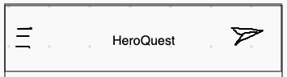
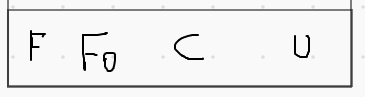
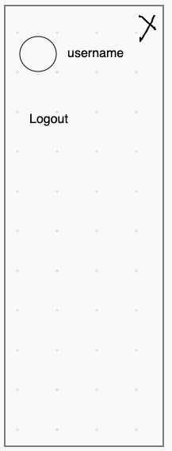
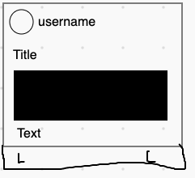
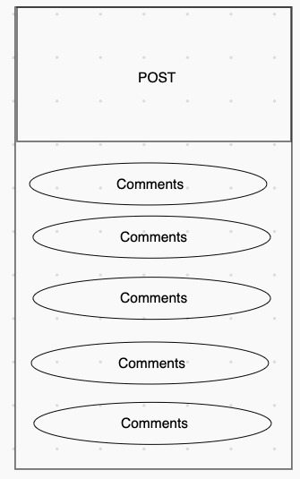
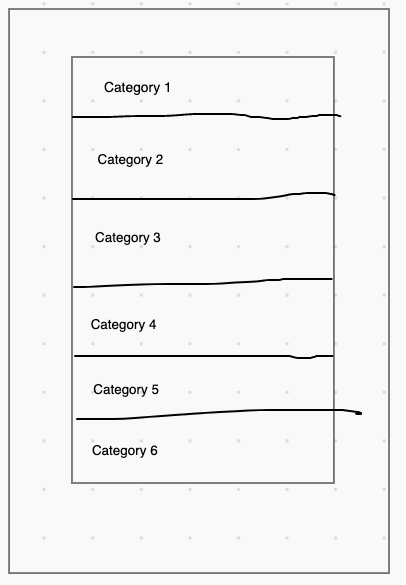
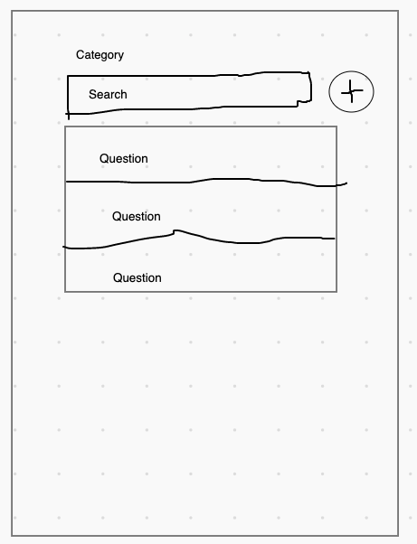

# Plan

## Login
Pages:
- Signup
- Main Menu

## Main Menu
Contains: 
* Component for Top Navbar

* Component for Bottom Navbar (Feed, Forum, Campaigns, User)

* Sidebar 

Pages:
- Messages
- Public Feed
- Question Forum
- Campaigns
- User

## Public Feed
(Main discussion, users can post posts (images, text, etc) that can be viewed by their followers)

Contents:
* Following users posts (Likes, Comments)

* Click comment -> Post comment page

Pages:
- User profile (of user that posted or user that posted comment)
- Post comment page

## Question Forum
Place where users can ask DnD related questions and get answers from community.

Contents: 
1. Forum Topics

2. Topic Questions

## Campaign

## Internal Chat
(Chat that is used when a campaign is being played)

---
Forum:
* Create the question forum ERNESTO 2 hrs

Campaign:
* Inventory Characters EMILIO 3 hrs
    * Dungeon Master:
        * Map Creator CARLA 4 hrs
        * Encounter Creator EMILIO 3 hrs
    * Hero:
        * Download Character Sheet EMILIO 1 hrs
        * Character Statistics EMILIO 4 hrs
* Internal Chat CARLA 6 hrs

# TODO (Emilio):
- Validate and sanitize user update info
- Upload info to firebase on modal close

Change post to reference user through uid, and not save it (for dynamic updates)
* POC: Posts, user changes username, posts username does not update
