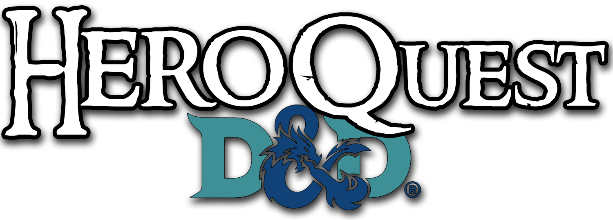
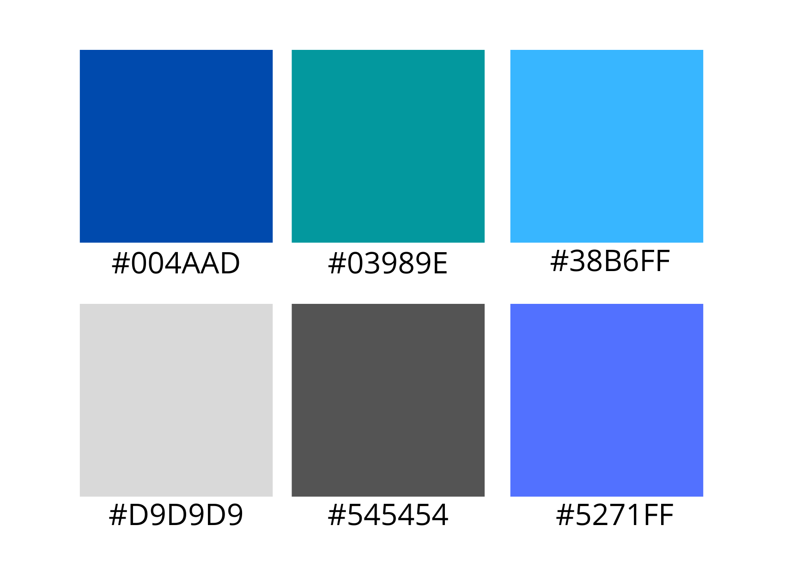

<br />
<p align="center">
    
  </a>

  <h1 align="center">Hero Quest</h1>

  <p align="center">
    A gaming platform to let your imagination run wild!
    <br />
  </p>
</p>

##### Integrantes:
1. [Isaac Garza Strimlingas] - [A01025798] - [CSF]
2. [Ernesto Ramirez Godinez] - [A01019589] - [CSF]
3. [Emilio Popovits Blake] - [A01027265] - [CSF]
4. [Carla Pérez Gavilán Del Castillo] - [A01023033] - [CSF]

---
## 1. Logo


## 2. Descripción y Objetivos

La aplicación HeroQuest tiene muchas características, como un creador de héroes (siguiendo las reglas escritas en el Manual del jugador de Dungeons and Dragons), creación de personajes, creación de historias, creación de mapas, compendio y creador de hechizos, notas de sesiones privadas del Dungeon Master y compendio de wiki privados (lado a lado), y mucho más. Además, esta aplicación genera automáticamente hojas de personajes para los personajes de los jugadores en PDF y les permite personalizar completamente la historia y la información de sus personajes.

El objetivo de HeroQuest es generar una comunidad de jugadores de “Dungeons and Dragons”, en la que cada usuario podrá personalizar sus partidas y crear juegos de manera infinita, dando rienda suelta a su imaginación, y conviviendo con otros jugadores de manera remota a través de la plataforma.

En la aplicación, los usuarios pueden crear campañas de Dungeons and Dragons, administrar sus personajes, jugar con sus personajes, ver los mapas de los lugares visitados, escribir notas sobre objetos o personajes que han encontrado en la campaña, y compartir la campaña a sus amigos.

### 3. Elementos a utilizar
 
```console
* <Text>
* <Image>
* <Button>
* <ImageBackground>
* <Modal>
* <ScrollBiew>
* <Switch>
* <TextInput>
* <Pressable>
* <KeyboardAvoidingView>
```

## 4. Gama de colores a utilizar 

Se utilizará una paleta de colores en su mayoría dominada por azules, los códigos HEX se presentan a continuación: 


## 5. Funcionalidades

* Creador de personaje interactivo
* Creador de mapas
* Creador de encuentros
* Creador de Character Sheet en PDF
* Tracker de inventario
* Tracker de conversaciones
* Tracker de estadísticas de personajes (monstruos derrotados, muertes, daño sufrido, etc)
* Chat interno
* Tracker de progreso de la campaña
* Rating de mapas públicos
* Rating de campañas públicas
* Forums
* Conexión a web-app
* oAuth (Facebook, Google, etc ...)

## 6. Project roadmap

## DESIGN 📝
* [ ] Overall screen flow design and color scheme. **ISAAC** _2 hrs_

## FRONTEND 🎨
 * [ ] Main Menu **CARLA** _2 hrs_
 * [ ] Map Creator  **CARLA**  _4 hrs_
 * [ ] Encounter Creator  **EMILIO** _3 hrs_
 * [ ] Download Character Sheet **EMILIO**  _1 hrs_
 * [ ] Create the question forum **ERNESTO** _2 hrs_
 * [ ] Login (Authentification)  **ISAAC**  _2 hrs_
 * [ ] Internal Chat **CARLA** _6 hrs_
 * [ ] Character Statistics **EMILIO** _4 hrs_
 * [ ] Public Campaigns Feed **ISAAC** _3 hrs_
 * [ ] Inventory Characters **EMILIO** _3 hrs_

## CONNECTION TO API/BACKEND 📲
* [ ] Connection to D&D API **EMILIO** _5 hrs_
* [ ] CRUD for users, characters, campaigns **ERNESTO y EMILIO** _8 hrs_
* [ ] Internal Chat **CARLA** _5 hrs_
* [ ] Generate aggregate functions for database statistics.  **ERNESTO** _6 hrs_
* [ ] Login authentification using Facebook and Google API. **ERNESTO** _6 hrs_
* [ ] Formatting files for pdf download. **EMILIO** _5 hrs_

## Notes (INSERT ONLY)
* [Google Sign In (Expo Go)](https://docs.expo.io/versions/latest/sdk/google/)
* [Google Sign In (Production)](https://docs.expo.io/versions/latest/sdk/google-sign-in/)
* [Manual Signin Handler (Firebase)](https://firebase.google.com/docs/auth/web/google-signin)
* [Expo Google Login Tutorial (YT)](https://www.youtube.com/watch?v=ZcaQJoXY-3Q&t=51s&ab_channel=UnsureProgrammer)