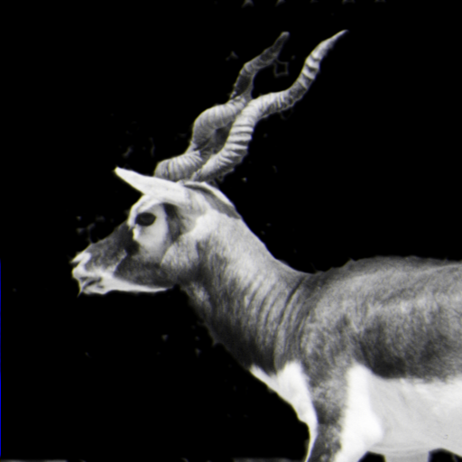
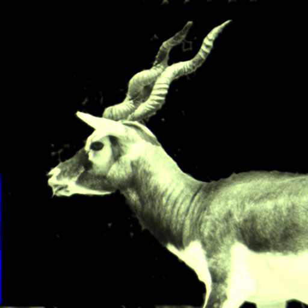
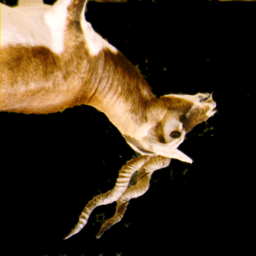
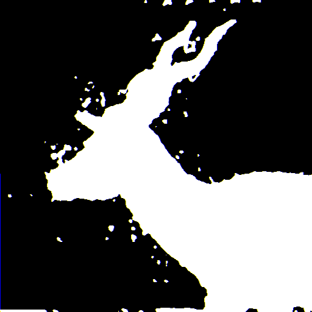

# Final Project Programming Languages - Instagram Filter simulator

* Isaac Garza Strimlingas - A01025798
* Abraham García del Corral - A01023256

## Project Topic

Image processing is a set of techniques used for altering an image integrity. An image viewed from the perspective of a computer is in reality a set of bytes (bytes are a set of 8 bits and a bit can be a 1 or a 0), that translates into three different colors: red, green and blue, that combined can make almost every color. 
In this project, we want to process different colored images in a special format called `bmp` (windows bitmap), a type of file that contains a map of bits or in simpler terms a matrix of bits, and convert it into different types of image (for example, grayscale or sepia).  


## Language

``Elixir``

## Solution


The program will read the bmp format image and store its initial value as binary (<b>File I/O</b>).
As a second step, the program will read the first 54 bytes which corresponds to the header of the image. This bytes contain metadata of the image and have to be the same in order to let the OS what type of file is. 

Depending on the filter or function used, the initial type of data changes. For instance in the negative function, the input is the raw binary data. On the other hand, the grasycale function uses a tuple of {R,G,B} corresponding to the channels of a colored image. So, each channel has to read 8 bits from the raw binary data in order to work as a channel.(<b>Comprehension</b>) is used in order to
create these tuples and iterate over them. Also the program uses comprehension again in order to convert the resulting list of the functions into binary again.
The program takes this binary data in order to write into the output file.

``````
Binary data is represented like:

<<104, 101, 196, 194, 0 ..>>
Used in negative method


Binary data converted in order to match a single byte and represent the RGB channels

<<104, 101, 196, 194, 0 ..>>  -> <<r::8, g::8, b::8>>
Used in grayscale method, after the match of a byte size, it is converted into a tuple.
``````

### Sample image
<p align="center">
  .
</p>

### Colored to negative
For each pixel, we will have 3 colors (red, green and blue) and each color channel are 1 byte long (8 bits), so the equivalent value on decimal base will range from 255 to 0. In order to make an image negative, the function will save each byte, convert it into decimal and make a decision based on the following condition; if the values ranges from 255 to 1, it will have to substract value from 255. in case the value is 0, it will have to add 255 to the value.

<p align="center">
  .
</p>


### Colored to grayscale 
As in colored to negative, the program will read 3 bytes corresponding to the R G B channels. Then for each channel, apply the corresponding formula to grayscale (R * 0.21 + G * 0.71 + B * 0.07) and save the result in the output list. 

<p align="center">
  .
</p>

### Sepia
Sepia filter uses the same structure as negative and colored. The program reads 3 bytes according to channels. The main difference is the formula used which in this case is the following:

SepiaR = (0.393 * R) + (0.769 * G) + (0.189 * B)

SepiaG = (0.349 * R) + (0.686 * G) + (0.168 * B)

SepiaB = (0.272 * R) + (0.534 * G) + (0.131 * B)

Then each result is compared with 255, if is greater than 255, the result value will be 255. Otherwise it remains like that. Then each result is saved in the output list.

<p align="center">
  .
</p>

### Mirror
The mirror function changes the order of the pixels, i.e. for each {R, G, B} it will return {G, B, R}

<p align="center">
  .
</p>

### Mask
Mask function looks for each pixel which value is different from 0 (Black), and changes it to 255 (White). By doing this we get a silhouette.

<p align="center">
  .
</p>

## References

* [Color Calculations by NVIDIA](http://harmanani.github.io/classes/csc447/Notes/Lecture16.pdf)
* [Colored to negative](https://dyclassroom.com/image-processing-project/how-to-convert-a-color-image-into-negative)
* [Joy of Elixir](https://joyofelixir.com/toc.html)
* [Elixir Documentation](https://hexdocs.pm/elixir/Kernel.htm)
