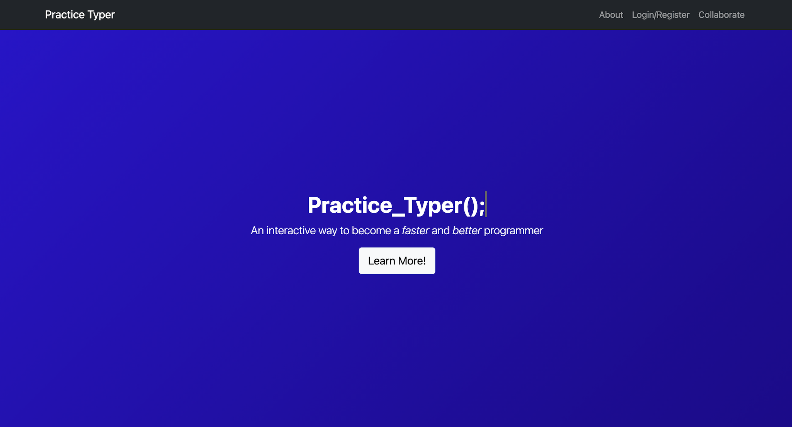

<!--
*** Thanks for checking out Flask-Practice-Typer-Team3. If you have a suggestion
*** that would make this better, please open an issue.
*** Thanks again!
***
***
***
-->

<!-- PROJECT SHIELDS -->
<!--
*** I'm using markdown "reference style" links for readability.
*** Reference links are enclosed in brackets [ ] instead of parentheses ( ).
*** See the bottom of this document for the declaration of the reference variables
*** for contributors-url, etc. This is the concise syntax.
*** https://www.markdownguide.org/basic-syntax/#reference-style-links
-->

<!-- PROJECT LOGO -->
<br />
<p align="center">
  <a href="https://github.com/CarlosHurand/IntegratorProject">
    
  </a>

  <h1 align="center">Practice Typer</h1>

  <p align="center">
    A website capable of  improving your skills as a programmer through the wonders of retyping. We aim to improve your typing speed, adaptability to different languages, and overall comfort by giving you the opportunity to retype code snippets.
    <br />
    <a href="https://github.com/CarlosHurand/IntegratorProject"><strong>Explore the docs »</strong></a>
    <br />
    <br />
    <a href="https://github.com/CarlosHurand/IntegratorProject/issues">Report Bug</a>
    ·
    <a href="https://github.com/CarlosHurand/IntegratorProject/issues">Request Feature</a>
  </p>
</p>

<!-- TABLE OF CONTENTS -->
<details open="open">
  <summary><h2 style="display: inline-block">Table of Contents</h2></summary>
  <ol>
    <li><a href="#landing-page">Landing Page</a></li>
    <li><a href="#built-with">Built With</a></li>
    <li><a href="#installation">Installation</a></li>
    <li><a href="#usage">Usage</a></li>
    <li><a href="#page-running-on-AWS">Page running on AWS</a></li>
    <li><a href="#contributions">Contributions</a></li>
    <li><a href="#license">License</a></li>
    <li><a href="#contact">Contact</a></li>
  </ol>
</details>

<!-- ABOUT THE PROJECT -->
## Landing Page

<p align = "center">
  <a href = "https://github.com/CarlosHurand/IntegratorProject">
    
  </a>
</P>

## Built With

* [Python](https://www.python.org/)
* [Flask](https://flask.palletsprojects.com/en/2.0.x/)

## Installation
1. Make sure you have python3 and pip3 installed.
2. download the project and cd into it's folder.
3. Inside the project folder do the following steps.
4. Run: ```pip3 install virtualenv```
5. Run: ```virtualenv env```
6. Activate env using:
    * Linux: ```source env/bin/activate```
    * Windows: ```.\env\Scripts\activate```
7. Run: ```pip3 install -r requirements.txt```
8. Run: ```flask init-db```
9. Run: ```flask run```
10. CTRL + Click on the https:// link or copy it to your browser.
11. Enjoy Practice Typer locally! <!--(try out the deployed version using the link on the "Page running on AWS" section of this README file.)-->

<!-- USAGE EXAMPLES -->
## Usage

1. Create an account.
2. Access a practice session.
3. Type out as many code snippets as possible in 60 seconds using Python, Javascript, or Java.
4. Watch how the website displays your stats like errors and accuracy.

<!--
***## Page running on AWS
***- *[Practice Typer](https://)*
-->

<!-- CONTRIBUTIONS -->
## Contributions

* [Isaac Garza - A01025798](https://github.com/isaacgs99)
* [Juan Carlos Hurtado - A01025193](https://github.com/carloshurand)

<!-- LICENSE -->
## License

Distributed under the MIT License. See `LICENSE` for more information.

<!-- CONTACT -->
## Contact

MLH Fellowship - [@MLHacks](https://twitter.com/MLHacks) - admissions@mlhfellowship.recruitee.com

Project Link: [https://github.com/CarlosHurand/IntegratorProject](https://github.com/CarlosHurand/IntegratorProject)
