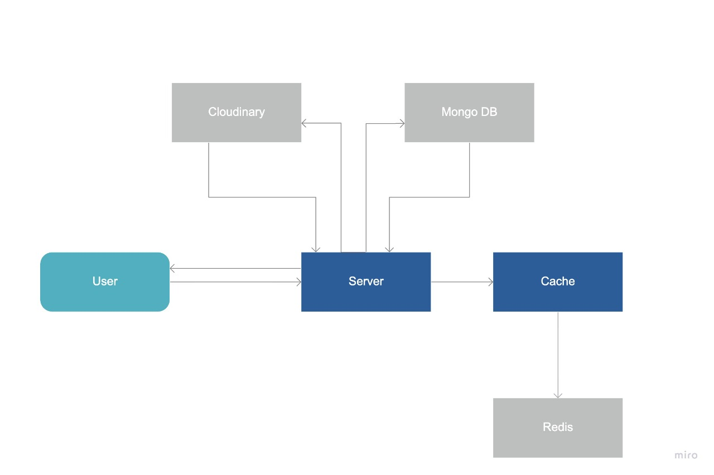

# TC3041 Final Proyect

# *SideQuest*
---

##### Team:
1. *Isaac Garza Strimlingas* - *A01025798* - *CSF*
2. *Emilio Popovits Blake* - *A01027265* - *CSF*

---
## 1. General Aspects

Project guidelines are available on the **Canvas** platform.

This document is a guide on what information you must deliver as part of the project, what technical requirements you must meet and the structure you must follow to organize its delivery.

### 1.1 Technical requirements

The minimum technical requirements of the project are mentioned below, please keep them in mind so that you comply with all of them.

* The team is free to choose the development technologies to use in the project.
* The project must use at least two different database models, from those studied in the course.
* The architecture must be modular, scalable, with redundancy and high availability.
* The architecture should be clearly separated by layers (*frontend*, *backend*, *RESTful API*, data and storage).
* The different components of the project (*frontend*, *backend*, *RESTful API*, databases, among others) must be executed on containers [Docker] (https://www.docker.com/) or deployed in a cloud service.
* All code, *datasets* and project documentation should be hosted in this GitHub repository following the structure below.

### 1.2 Repository structure
```
 
- /
    - bin/                  # Directory that contains all of the ExpressJs boilerplate code
    - controllers/          # Dierectory that contains all of the main backend driver "api" functions
    - models/               # Directory that contains all of the database schemas used in MongoDB with MongooseJs
    - plugins/              # Directory that contains the frontend WYSIWYG plugin files
    - public/               # Directory that contains all the public assets sent to every browser
        - images/           # Directory that contains all the image assets used in SideQuest DnD
        - javascripts/      # Directory that contains all the frontend JS helper functions for SideQuest DnD
        - pdfs/             # Directory that contains all the PDFs used to render character information
        - stylesheets/      # Directory that contains all the styles for the website
    - routes/               # Directory that contains all the ExpressJs routes for the project
    - views/                # Directory that contains all of the frontend template views in PugJs
    - .env                  # File that contains all the environment variables
    - .gitignore            # Git file to ignore specific files such as .env and node_modules/
    - app.js                # File that contains all the main start driver code for the website
    - package-lock.json     # NPM file which contains all of the dependencies
    - package.json          # NPM file which contains all of the dependencies and project setup
    - README_O.md           # Personal reference readme file
    - README.md             # Documentation readme file
    - webpack.config.js     # Webpack configuration file
```

### 1.3 Project documentation

As part of the final delivery of the project, the following information must be included:

* Justification of the models of *databases* that they selected.
* Description of the *dataset* (s) and the sources of information used.
* Guide for configuration, installation and deployment of the solution.
* API documentation (if applicable). You can see an example at [Swagger](https://swagger.io/).
* The code must be documented following the standards defined for the selected programming language.

## 2. Project description

*SideQuest is a web platform for playing the famous role playing game called "Dungeons & Dragons" or better known as D&D or DnD. The purpose of the proyect was to make an online experience of the famous game and to take advantage of different web services to create a more diverse game, speccially in characters and heroes creation.*

## 3. Solution

The different elements that are part of the project solution are described below:

### 3.1 Models of *databases* used

*SideQuest DnD uses two different NoSQL databases to store its data: MongoDB and Redis*

#### 3.1.1 MongoDB
* *MongoDB was selected as the main database of the project as all the data is handled in JSON format and the use of Mongo facilitates the manipulation and CRUD operations of the data as this project is mainly a JavaScript project.*

* *There are certain objects in the proyect that have similar (but not always the same amount of) attributes and Mongo can ensure the use of the same model for different cases, putting some attributes on each object deppending the case*

* *MongoDB saves space in memory by not specifing attributes in a document, when they are `null`in SQL) if you have a `null` value, it is specified in the exact attribute*

#### 3.1.2 Redis
* *Redis was selected as the secondary database of the project as all the user sessions cookies are handled as cache.*

* *Cache improves the speed for the webpage because, each time that a user wants to use the webpage and it has logged in before, the backend does not have to fetch the user from the main DB*

* *User session's handled in Redis, help to mantain security for each user, because if someone leaved their user account open, in a specified time, it logs out automatically*

## 3.2 Solution architecture


### 3.3 Frontend

*As a solution for the frontend part of the project, Pug templating language (previously Jade) was used. This means that SideQuest DnD is a monolithic web application. Pug templating language was used, even though it has it's own cons, as it is much easier to deploy the package as a whole in services such as Heroku (just deploy one package on one port, instead of deploying the frontend and backend separately), and it provides a very declarative way of developing the user experience.*

#### 3.3.1 Programming language
*The programming language used for the frontend part of the project is [PugJs](https://pugjs.org/) (previously known as Jade), which has it's own syntax and can be mixed with JavaScript code.*

#### 3.3.2 Framework
*The framework used for the frontend of the project is also PugJs, as it integrates well and easily with NodeJs and ExpressJs and it works by rendering the templated structure of the page first in the backend into HTML code and then serving it to the user.*

#### 3.3.3 Libraries/Dependencies
* *[CkEditor 5](https://ckeditor.com/) - Used to render the WYSIWYG text editor in the website in several different sections*
* *[Webpack](https://webpack.js.org/) - Used to bundle the CkEditor code and configurations so that it's useable in the PugJs templates*

### 3.4 API/backend

*As a solution for the backend part of the project, primarily [NodeJs](https://nodejs.org/) and [ExpressJs](http://expressjs.com/) were used to implement the project as handling routes and dependencies is much easier with these two JavaScript frameworks. As this is a monolithic aplication, APIs were not used in a formal way, as the backend instead of returning JSON payloads to the frontend loads the processed information into the specified PugJs template and then renders the PugJs template into HTML code, returning it to the user's browser.*

#### 3.4.1 Programming language
*The programming language used for the backend portion of the project is completely [JavaScript](https://www.javascript.com/).*

#### 3.4.2 Framework
*The main framework used for the backend of this project is NodeJs.*

#### 3.4.3 Libraries/Dependencies
* *[NodeJs](https://nodejs.org/) - For running the JavaScript environment in the server*
* *[ExpressJs](http://expressjs.com/) - For handling routes and backend processes*
* *[mongodb](https://www.npmjs.com/package/mongodb) - For connecting to MongoDB*
* *[mongoose](https://www.npmjs.com/package/mongoose) - Middleware for MongoDB*
* *[cloudinary](https://www.npmjs.com/package/cloudinary) - For image uploads*
* *[multer](https://www.npmjs.com/package/multer) - For handling `enctype="multipart/form-data"`*
* *[dotenv](https://www.npmjs.com/package/dotenv) - For allowing .env files and usage through process.env.VAR for delicate data*
* *[compression](https://www.npmjs.com/package/compression) - For compressesing files and optimizing website for user use*
* *[helmet](https://www.npmjs.com/package/helmet) - For securing website data*
* *[body-parser](https://www.npmjs.com/package/helmet) - For limiting the request body payload the user can submit*
* *[express-rate-limit](https://www.npmjs.com/package/express-rate-limit) - For limiting the amount of requests per window of time a user can make*
* *[express-mongo-sanitize](https://www.npmjs.com/package/express-mongo-sanitize) - For replacing '$' and '.' from user inputs to prevent NoSQL injection attacks*
* *[express-session](https://www.npmjs.com/package/express-session) - For handling sessions*
* *[express-validator](npmjs.com/package/express-validator) - For validating and sanitizing user inputs*
* *[mongoose-bcrypt](https://www.npmjs.com/package/mongoose-bcrypt) - For hashing and salting passwords and sensitive information*
* *[passport](https://www.npmjs.com/package/passport) - For authenticating info and passwords through strategies*
    * *[passport-local](https://www.npmjs.com/package/passport-local) - Local strategy for passport*
    * *[passport-local-mongoose](https://www.npmjs.com/package/passport-local-mongoose) - Local strategy for mongoose passport*
* *[connect-flash](npmjs.com/package/connect-flash) - Provides methods for flash messages*
* *[pdflib](https://pdf-lib.js.org/) - For editing and rendering pdfs programatically*

#### 3.4.4 API Endpoints

**Note:** As the frontend and backend are integrated together (monolithic), most (if not all) of the `GET` routes from the "API" do not respond with a JSON payload as such, but instead render the JSON response into an HTML file following a PugJs template and returns it to the user's browser.

**Note:** As the frontend and backend are integrated together (monolithic), and both are managed by ExpressJs, all of the errors that may occur on any route are automatically handled by ExpressJs error handler. If you want a detailed list of the errors that may be handled by ExpressJs, please look at the dependency list's documentation (for each dependency) and see which errors each dependency outputs (the extension is very large to include in this file).

* **Description**: Responds with SideQuest DnD's home page.
* **HTTP Verbs**: `GET`
* **URL**: `/`
---
* **Description**: Responds with SideQuest DnD's character heroes page.
* **HTTP Verbs**: `GET`
* **URL**: `/heroes`
---
* **Description**: Responds with SideQuest DnD's hero information page.
* **HTTP Verbs**: `GET`
* **URL**: `/heroes/:heroName`
---
* **Description**: Responds with SideQuest DnD's hero information in PDF.
* **HTTP Verbs**: `GET`
* **URL**: `/heroes/:hero/charactersheet/:selector`
---
* **Description**: Responds with SideQuest DnD's NPC characters page.
* **HTTP Verbs**: `GET`
* **URL**: `/characters`
---
* **Description**: Responds with SideQuest DnD's NPC character info page.
* **HTTP Verbs**: `GET`
* **URL**: `/characters/:characterName`
---
* **Description**: Creates comment in NPC character info page.
* **HTTP Verbs**: `POST`
* **URL**: `/characters/:characterName/createcomment`
* **JSON body request format**: 
```js
{
    "user_id": mongoose.Types.ObjectId,
    "username": String,
    "date": Date,
    "text": String
}
```
---
* **Description**: Deletes comment in NPC character info page.
* **HTTP Verbs**: `POST`
* **URL**: `/characters/:characterName/deletecomment/:commentId`
---
* **Description**: Search character in NPC info page.
* **HTTP Verbs**: `POST`
* **URL**: `/characters/search`
* **JSON body request format**: 
```js
{
    "name": String,
    "relationship": String,
    "place": String,
    "race": String
}
```
---
* **Description**: Responds with SideQuest DnD's story page.
* **HTTP Verbs**:`GET`
* **URL**: `/story`
---
* **Description**: Responds with SideQuest DnD's story info.
* **HTTP Verbs**: `GET`
* **URL**: `/story/:storyId`
---
* **Description**: Creates a comment on a specific story.
* **HTTP Verbs**: `POST`
* **URL**: `/story/:storyId/createcomment`
* **JSON body request format**:
```js
{
    "user_id": mongoose.Types.ObjectId,
    "username": String,
    "date": Date,
    "text": String
}
```
---
* **Description**: Deletes a comment on a specific story.
* **HTTP Verbs**: `POST`
* **URL**: `/story/:storyId/deletecomment/:commentId`
------
* **Description**: Search story in stories page.
* **HTTP Verbs**: `POST`
* **URL**: `/story/search`
* **JSON body request format**: 
```js
{
    "name": String 
}
```
------
* **Description**: Responds with SideQuest DnD's maps page.
* **HTTP Verbs**: `GET`
* **URL**: `/maps`
---
* **Description**: Responds with a specific map in the maps page.
* **HTTP Verbs**:`GET`
* **URL**: `/maps/:mapId`
---
* **Description**: Creates a comment on a map.
* **HTTP Verbs**: `POST`
* **URL**: `/maps/:mapId/createcomment`
* **JSON body request format**: 
```js
{
    "user_id": mongoose.Types.ObjectId,
    "username": String,
    "date": Date,
    "text": String
}
```
---
* **Description**: Deletes a comment on a map.
* **HTTP Verbs**: `POST`
* **URL**: `/maps/:mapId/deletecomment/:commentId`
---
* **Description**: Search a map on the maps page.
* **HTTP Verbs**: `POST`
* **URL**: `/maps/search`
* **JSON body request format**: 
```js
{
    "name": String 
}
```
---
* **Description**: Responds with SideQuest DnD's login page.
* **HTTP Verbs**: `GET`
* **URL**: `/login`
---
* **Description**: Sends information to log user in or deny to it.
* **HTTP Verbs**: `POST`
* **URL**: `/login`
* **JSON body request format**:
```js
{
    "username": String,
    "password": String
}
```
---
* **Description**: Responds with SideQuest DnD's signup page.
* **HTTP Verbs**: `GET`
* **URL**: `/signup`
---
* **Description**: Sends information of a new user to create in DB.
* **HTTP Verbs**: `POST`
* **URL**: `/signup`
* **JSON body request format**: 
```js
{
    "username": String,
    "password": String,
    "confirm_password": String
}
```
---
* **Description**: Responds with SideQuest DnD's login page.  
* **HTTP Verbs**: `GET`
* **URL**: `/logout`
---
* **Description**: Responds with SideQuest DnD's signup page.
* **HTTP Verbs**: `GET`
* **URL**: `/users`
---
* **Description**: Responds with SideQuest DnD's user account page.
* **HTTP Verbs**: `GET`
* **URL**: `/users/account`
---
* **Description**: Edit info of user's account.
* **HTTP Verbs**: `POST`
* **URL**: `/users/account`
* **JSON body request format**: 
```js
{
    "username": String,
    "password": String,
    "confirm_password": String
}
```
---
* **Description**: Responds with SideQuest DnD's user heroes page.
* **HTTP Verbs**: `GET`
* **URL**: `/users/heroes`
---
* **Description**: Responds with SideQuest DnD's user new hero page.
* **HTTP Verbs**: `GET`
* **URL**: `/users/heroes/newHero`
---
* **Description**: Creates a new hero for user.
* **HTTP Verbs**: `POST`
* **URL**: `/users/heroes/newHero`
* **JSON body request format**:
```js
{
    "name": String,
    "image": String,
    "race": mongoose.Schema.Types.ObjectId,
    "class": mongoose.Schema.Types.ObjectId,
    "class_proficiencies": [String],
    "level": Number,
    "xp": Number,
    "abilities": {
        "inspiration": Boolean,
        "proficiency_bonus": Number,
        "passive_perception": Number,
        "strength": {
            "base_score": Number,
            "racial_bonus": Number,
            "improvements": Number,
            "misc_bonus": Number,
            "total_score": Number,
            "modifier": Number,
            "other": Number,
            "override": Number
        },
        "dexterity": {
            "base_score": Number,
            "racial_bonus": Number,
            "improvements": Number,
            "misc_bonus": Number,
            "total_score": Number,
            "modifier": Number,
            "other": Number,
            "override": Number
        },
        "constitution": {
            "base_score": Number,
            "racial_bonus": Number,
            "improvements": Number,
            "misc_bonus": Number,
            "total_score": Number,
            "modifier": Number,
            "other": Number,
            "override": Number
        },
        "intelligence": {
            "base_score": Number,
            "racial_bonus": Number,
            "improvements": Number,
            "misc_bonus": Number,
            "total_score": Number,
            "modifier": Number,
            "other": Number,
            "override": Number
        },
        "wisdom": {
            "base_score": Number,
            "racial_bonus": Number,
            "improvements": Number,
            "misc_bonus": Number,
            "total_score": Number,
            "modifier": Number,
            "other": Number,
            "override": Number
        },
        "charisma": {
            "base_score": Number,
            "racial_bonus": Number,
            "improvements": Number,
            "misc_bonus": Number,
            "total_score": Number,
            "modifier": Number,
            "other": Number,
            "override": Number
        }
    },
    "saving_throws": {
        "strength": Boolean,
        "dexterity": Boolean,
        "constitution": Boolean,
        "intelligence": Boolean,
        "wisdom": Boolean,
        "charisma": Boolean
    },
    "skills": {
        "acrobatics": Boolean,
        "animal_handling": Boolean,
        "arcana": Boolean,
        "athletics": Boolean,
        "deception": Boolean,
        "history": Boolean,
        "insight": Boolean,
        "intimidation": Boolean,
        "investigation": Boolean,
        "medicine": Boolean,
        "nature": Boolean,
        "perception": Boolean,
        "performance": Boolean,
        "persuasion": Boolean,
        "religion": Boolean,
        "sleight_of_hand": Boolean,
        "stealth": Boolean,
        "survival": Boolean
    },
    "physical_attributes": {
        "ac": Number,
        "initiative": Number,
        "speed": Number,
        // Not used in page from here till bottom of physical_attributes[]
        "current_hp": Number,
        "temp_hp": Number,
        "current_hitdie": Number,
        "deathsaves_success": Number,
        "deathsaves_fail": Number,
    },
    "description": {
        "background": String,
        "alignment": String,
        "faith": String,
        "place_of_origin": String,
        "physical": {
            "age": Number,
            "height": String,
            "weight": Number,
            "eye_color": String,
            "skin_color": String,
            "hair_color": String,
            "gender": String
        },
        "personality": {
            "traits": String,
            "ideals": String,
            "bonds": String,
            "flaws": String
        },
        "notes": {
            "organization": {
                "text": String,
                "name": String,
                "emblem": String
            },
            "allies" : String,
            "enemies": String,
            "backstory": String,
            "other": String
        }
    },
    "equipment": {
        "starting": String,
        "weapons": {
            "list": [{
                "name": String,
                "attackBonus": Number,
                "damage": String
            }],
            "notes": String
        },
        "money": {
            "copper": Number,
            "silver": Number,
            "electrum": Number,
            "gold": Number,
            "platinum": Number
        },
        "active": String,
        "inventory": String,
        "treasure": String
    },
    "additional_info": {
        "features_and_traits": String,
        "additional_features_traits": String,
        "proficiencies_and_languages": String
    },
    "spells": {
        "racial": [mongoose.Schema.Types.ObjectId],
        "class": [mongoose.Schema.Types.ObjectId]
    }
}
```
---
* **Description**: Responds with SideQuest DnD's user hero page with a specific hero.
* **HTTP Verbs**: `GET`
* **URL**: `/users/heroes/:heroId`
---
* **Description**: Updates information of a specific user's hero.
* **HTTP Verbs**: `POST`
* **URL**: `/users/heroes/:heroId`
* **JSON body request format**:
```js
{
    "name": String,
    "image": String,
    "race": mongoose.Schema.Types.ObjectId,
    "class": mongoose.Schema.Types.ObjectId,
    "class_proficiencies": [String],
    "level": Number,
    "xp": Number,
    "abilities": {
        "inspiration": Boolean,
        "proficiency_bonus": Number,
        "passive_perception": Number,
        "strength": {
            "base_score": Number,
            "racial_bonus": Number,
            "improvements": Number,
            "misc_bonus": Number,
            "total_score": Number,
            "modifier": Number,
            "other": Number,
            "override": Number
        },
        "dexterity": {
            "base_score": Number,
            "racial_bonus": Number,
            "improvements": Number,
            "misc_bonus": Number,
            "total_score": Number,
            "modifier": Number,
            "other": Number,
            "override": Number
        },
        "constitution": {
            "base_score": Number,
            "racial_bonus": Number,
            "improvements": Number,
            "misc_bonus": Number,
            "total_score": Number,
            "modifier": Number,
            "other": Number,
            "override": Number
        },
        "intelligence": {
            "base_score": Number,
            "racial_bonus": Number,
            "improvements": Number,
            "misc_bonus": Number,
            "total_score": Number,
            "modifier": Number,
            "other": Number,
            "override": Number
        },
        "wisdom": {
            "base_score": Number,
            "racial_bonus": Number,
            "improvements": Number,
            "misc_bonus": Number,
            "total_score": Number,
            "modifier": Number,
            "other": Number,
            "override": Number
        },
        "charisma": {
            "base_score": Number,
            "racial_bonus": Number,
            "improvements": Number,
            "misc_bonus": Number,
            "total_score": Number,
            "modifier": Number,
            "other": Number,
            "override": Number
        }
    },
    "saving_throws": {
        "strength": Boolean,
        "dexterity": Boolean,
        "constitution": Boolean,
        "intelligence": Boolean,
        "wisdom": Boolean,
        "charisma": Boolean
    },
    "skills": {
        "acrobatics": Boolean,
        "animal_handling": Boolean,
        "arcana": Boolean,
        "athletics": Boolean,
        "deception": Boolean,
        "history": Boolean,
        "insight": Boolean,
        "intimidation": Boolean,
        "investigation": Boolean,
        "medicine": Boolean,
        "nature": Boolean,
        "perception": Boolean,
        "performance": Boolean,
        "persuasion": Boolean,
        "religion": Boolean,
        "sleight_of_hand": Boolean,
        "stealth": Boolean,
        "survival": Boolean
    },
    "physical_attributes": {
        "ac": Number,
        "initiative": Number,
        "speed": Number,
        // Not used in page from here till bottom of physical_attributes[]
        "current_hp": Number,
        "temp_hp": Number,
        "current_hitdie": Number,
        "deathsaves_success": Number,
        "deathsaves_fail": Number,
    },
    "description": {
        "background": String,
        "alignment": String,
        "faith": String,
        "place_of_origin": String,
        "physical": {
            "age": Number,
            "height": String,
            "weight": Number,
            "eye_color": String,
            "skin_color": String,
            "hair_color": String,
            "gender": String
        },
        "personality": {
            "traits": String,
            "ideals": String,
            "bonds": String,
            "flaws": String
        },
        "notes": {
            "organization": {
                "text": String,
                "name": String,
                "emblem": String
            },
            "allies" : String,
            "enemies": String,
            "backstory": String,
            "other": String
        }
    },
    "equipment": {
        "starting": String,
        "weapons": {
            "list": [{
                "name": String,
                "attackBonus": Number,
                "damage": String
            }],
            "notes": String
        },
        "money": {
            "copper": Number,
            "silver": Number,
            "electrum": Number,
            "gold": Number,
            "platinum": Number
        },
        "active": String,
        "inventory": String,
        "treasure": String
    },
    "additional_info": {
        "features_and_traits": String,
        "additional_features_traits": String,
        "proficiencies_and_languages": String
    },
    "spells": {
        "racial": [mongoose.Schema.Types.ObjectId],
        "class": [mongoose.Schema.Types.ObjectId]
    }
}
```
---
* **Description**: Responds with SideQuest DnD's spells compendium page.
* **HTTP Verbs**: `GET`
* **URL**: `/users/spells`
---
* **Description**: Saves a spell for SideQuest DnD's spell compendium.
* **HTTP Verbs**: `POST`
* **URL**: `/users/savespell`
* **JSON body request format**:
```js
{
    "name": String,
    "level": Number,
    "school": String,
    "ritual": Boolean,
    "concentration": Boolean,
    "casting_time": String,
    "range": String,
    "components": [String],
    "materials": String,
    "duration": String,
    "description": String
}
```
---
* **Description**: Updates a spell for SideQuest DnD.
* **HTTP Verbs**: `POST`
* **URL**: `/users/editSpell`
* **JSON body request format**:
```js
{
    "name": String,
    "level": Number,
    "school": String,
    "ritual": Boolean,
    "concentration": Boolean,
    "casting_time": String,
    "range": String,
    "components": [String],
    "materials": String,
    "duration": String,
    "description": String
}
```
---
* **Description**: Responds with a SideQuest DnD's spell.
* **HTTP Verbs**: `GET`
* **URL**: `/users/spells/search`
---
* **Description**: Responds with a SideQuest DnD's campaign story page.
* **HTTP Verbs**: `GET`
* **URL**: `/users/story`
---
* **Description**: Search a story in SideQuest DnD's campaign page.
* **HTTP Verbs**: `POST`
* **URL**: `/users/story/search`
* **JSON body request format**: 
```js
{
    "name": String
}
```
---
* **Description**: Responds with a SideQuest DnD's campaign new story page.
* **HTTP Verbs**: `GET`
* **URL**: `/users/story/newstory`
---
* **Description**: Creates a new SideQuest DnD campaign story.
* **HTTP Verbs**: `POST`
* **URL**: `/users/story/newstory`
* **JSON body request format**:
```js
{
    "name": String,
    "summary": String,
    "comments": [{
        "character_id": mongoose.Schema.Types.ObjectId,
        "character": String,
        "text": String
    }]
}
```
---
* **Description**: Responds with a SideQuest DnD's specific campaign story page.
* **HTTP Verbs**: `GET`
* **URL**: `/users/story/edit/:storyId`
---
* **Description**: Updates a specific campaign story.
* **HTTP Verbs**: `POST`
* **URL**: `/users/story/edit/:storyId`
* **JSON body request format**: 
```js
{
    "name": String,
    "summary": String,
    "comments": [{
        "character_id": mongoose.Schema.Types.ObjectId,
        "character": String,
        "text": String
    }]
}
```
---
* **Description**: Responds with SideQuest DnD's NPC character page.
* **HTTP Verbs**: `GET`
* **URL**: `/users/characters`
---
* **Description**: Search for a character in NPC info page. 
* **HTTP Verbs**: `POST`
* **URL**: `/users/characters/search`
* **JSON body request format**:
```js
{
    "name": String,
    "relationship": String,
    "place": String,
    "race": String
}
```
---
* **Description**: Responds with SideQuest DnD's new NPC character page.
* **HTTP Verbs**: `GET`
* **URL**: `/users/characters/newcharacter`
---
* **Description**: Creates a new NPC character. 
* **HTTP Verbs**: `POST`
* **URL**: `/users/characters/newcharacter`
* **JSON body request format**: 
```js
{
    "name": String,
    "image": String,
    "title": String,
    "relationship": String,
    "affiliation": String,
    "place": String,
    "race": String,
    "class": String,
    "age": Number,
    "size": String,
    "appearance": String,
    "summary": String,
    "comments": [{
        "user_id": mongoose.Types.ObjectId,
        "username": String,
        "date": Date
        "text": String
    }]
}
```
---
* **Description**: Responds with SideQuest DnD's edit NPC character page.
* **HTTP Verbs**: `GET`
* **URL**: `/users/characters/edit/:characterId`
---
* **Description**: Updates a specific NPC character.
* **HTTP Verbs**: `POST`
* **URL**: `/users/characters/edit/:characterId`
* **JSON body request format**: 
```js
{
    "name": String,
    "image": String,
    "title": String,
    "relationship": String,
    "affiliation": String,
    "place": String,
    "race": String,
    "class": String,
    "age": Number,
    "size": String,
    "appearance": String,
    "summary": String,
    "comments": [{
        "user_id": mongoose.Types.ObjectId,
        "username": String,
        "date": Date
        "text": String
    }]
}
```
---
* **Description**: Responds with SideQuest DnD's campaign maps page.
* **HTTP Verbs**: `GET`
* **URL**: `/users/maps`
---
* **Description**: Search a map on the maps page.
* **HTTP Verbs**: `POST`
* **URL**: `/users/maps/search`
* **JSON body request format**: 
```js
{
    "name": String
}
```
---
* **Description**: Responds with SideQuest DnD's new maps page.
* **HTTP Verbs**: `GET`
* **URL**: `/users/maps/newmap`
---
* **Description**: Create a new map.
* **HTTP Verbs**: `POST`
* **URL**: `/users/maps/newmap`
* **JSON body request format**:
```js
{
    "name": String,
    "image": String,
    "description": String,
    "comments": [{
        "user_id": mongoose.Types.ObjectId,
        "username": String,
        "date": Date
        "text": String
    }]
}
```
---
* **Description**: Responds with SideQuest DnD's edit map page.
* **HTTP Verbs**: `GET`
* **URL**: `/users/maps/edit/:mapId`
---
* **Description**: Edit a specific campaign map.
* **HTTP Verbs**: `POST`
* **URL**: `/users/maps/edit/:mapId`
* **JSON body request format**: 
```js
{
    "name": String,
    "image": String,
    "description": String,
    "comments": [{
        "user_id": mongoose.Types.ObjectId,
        "username": String,
        "date": Date
        "text": String
    }]
}
```
---

## 3.5 Steps to follow to use the project

**Note**: If you do not want to deploy the project by yourself, you can view it at http://sidequestdnd.herokuapp.com

<br />
Clone the git repository:
```sh
git clone https://github.com/empobla/sidequestdnd.git
```

Insert environment variables into a `.env` file in the project repository. This file should have entries for:
* DB (MongoDB URI)
* REDIS (Redis URI endpoint)
* REDIS_PASS (Redis database password)
* SECRET (Secret to encrypt user sessions)
* CLOUDINARY_NAME (Cloudinary name)
* CLOUDINARY_API_KEY (Cloudinary API Key)
* CLOUDINARY_API_SECRET (Cloudinary API Secret)

In addition, the environment variables should have the following format, and the same names that are specified above:
```txt
DB=mongodb+srv://...
REDIS=...
REDIS_PASS=...
SECRET=...
```

Install the project's dependencies:
```sh
npm i
```

Run the project in localhost in order to make sure everything works as expected:
```sh
npm run devstart    # Opens server on localhost:3000
```

With the Heroku CLI, open heroku and login:
```sh
heroku
heroku login
```

Create a new Heroku app:
```sh
heroku create
```

Confirm that a remote named `heroku` has been set for the project:
```sh
git remote -v
```

Deploy the proyect with Heroku:
```sh
git push heroku main
```

Open the Heroku console on your browser, and enter the environment variables from `.env` into the project.

Enter the project's website to see if it deployed successfully.

## 4. References

* **pdf-lib GitHub**: https://github.com/Hopding/pdf-lib
* **pdf-lib Docs**: https://pdf-lib.js.org/
* **CKEditor5 API Reference**: https://ckeditor.com/docs/ckeditor5/latest/api/index.html
