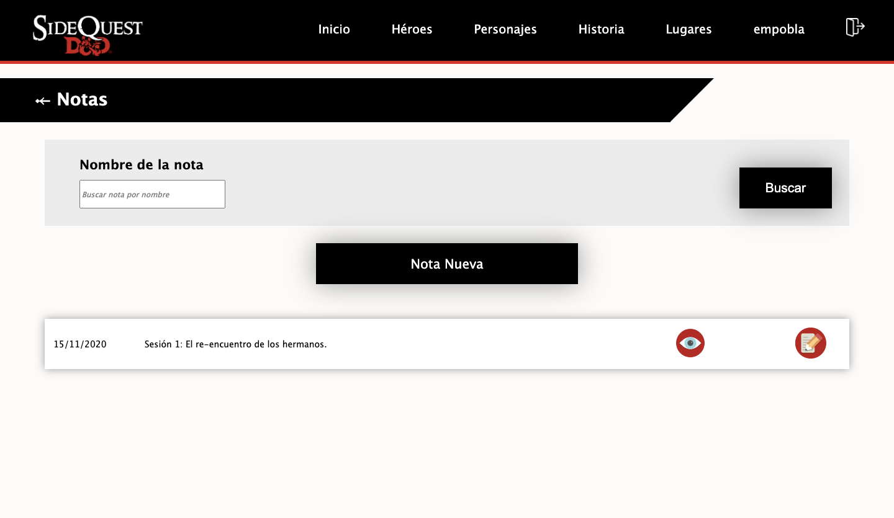

<p align='center'>

</p>

# SideQuest D&D
SideQuest D&D website repository for tracking changes and pushing to production.

---
## Index
- [Setup](#setup)
    - [Files Setup](#files-setup)
- [Deploying with Heroku](#deploying-with-heroku)
- [Dependency List](#dependency-list)
- [CKEditor5](#ckeditor5)
- [Useful Git Commands](#useful-git-commands)
- [Using WSL and NPM](#using-wsl-and-npm)
- [Versions](#versions)
    - [Alpha](#sidequest-dd-alpha)
    - [Release 1.0](#sidequest-dd-release-10)
---

## Setup

### Initial Setup:
```sh
express . --view=pug
npm install
npm i --save-dev nodemon
```

### In package.json:
Under "scripts" object, write the following line:

```js
"devstart": "nodemon ./bin/www"
```

so that scripts object looks like this:

```js
"scripts": {
    "start": "node ./bin/www",
    "devstart": "nodemon ./bin/www"
}
```
### Running the Node Server
In order to run the node server with nodemon, in the console run:

```sh
npm run devstart
```

### Files Setup
---
([Back to top](#index))

After installing dependencies, create a new **.env** file in the project directory.
#### app.js
First Line:
```js
require('dotenv').config();
```

Requires (at top level):
```js
// Mongo
const MongoClient = require('mongodb').MongoClient;
const mongoose = require('mongoose');

// Helmet and compression
const compression = require('compression');
const helmet = require('helmet');

// For sessions
const session = require('express-session');
const MongoStore = require('connect-mongo')(session);

// For messages
const flash = require('connect-flash');

// For passport.js
const User = require('./models/user');
const passport = require('passport');
```

Database (before app.use()):
```js
// Setup mongoose connection
const connectMongo = async () => {
    await mongoose.connect(process.env.DB, {
        useNewUrlParser: true,
        useUnifiedTopology: true,
        useFindAndModify: false
    });
}
connectMongo();
mongoose.Promise = global.Promise;
mongoose.set('useCreateIndex', true); // Because of deprecation of ensureIndex

// DB Connection Error Detection
const db = mongoose.connection;
db.on('error', console.error.bind(console, 'connection error:'));
db.once('open', function() {
    console.log('Connected to DB');
});
```
        
Middleware (app.use()):
```js
// Set up helmet middleware
app.use(helmet());  // Should be as early as possible

// Compress responses
app.use(compression());

// Set up session middleware
app.use(session({
    secret: process.env.SECRET,
    saveUninitialized: false,
    resave: false,
    store: new MongoStore({ mongooseConnection: mongoose.connection })
}));

// Configure Passport Middleware
app.use(passport.initialize());
app.use(passport.session());

passport.use(User.createStrategy());

passport.serializeUser(User.serializeUser());
passport.deserializeUser(User.deserializeUser());

// Flash messages
app.use(flash());

// Custom Middleware
app.use((req, res, next) => {
    res.locals.user = req.user;
    res.locals.url = req.path;
    res.locals.flash = req.flash();
    next();
});
```
    
#### package.json
At the end (when exporting to production):
```js
"engines": {
    "node": "14.5.0" (node version)
}
```

## Deploying With Heroku
---
([Back to top](#index))

1. Run `git init` in project directory.
2. Add package.json [engines](#package.json) object.
3. Create a **.gitignore** file. Ignore the **/node_modules** folder, the **.env** file, and all other files that aren't necessary for the project or have sensitive information.
4. Run `git status` to check what will be pushed to heroku's git.
5. Run `git add .` to stage all of the files in the project directory that appear after running the `git status` command.
6. Run `git commit -m 'Initial commit'` to commit all of the staged files to git, with the message of "Initial commit".
7. Run `heroku login` to login to your Heroku account.
8. Run `heroku git:remote -a sidequestdnd` to link project with Heroku.
9. Run `git push heroku master` to push project to git and deploy to Heroku.
10. Run `heroku open` to open heroku website in web browser.

## Deploying With GitHub
---
([Back to top](#index))

1. Run `git init` in project directory.
2. Add package.json [engines](#package.json) object.
3. Create a **.gitignore** file. Ignore the **/node_modules** folder, the **.env** file, and all other files that aren't necessary for the project or have sensitive information.
4. Create a GitHub repository for project in GitHub website.
5. Link project directory to GitHub repository.
6. Run `git add .` to stage all of the files in the project directory that appear after running the `git status` command.
7. Run `git commit -m 'Initial commit'` to commit all of the staged files to the GitHub repository, with the message of "Initial commit".
8. Open Heroku website dashboard, and in "Deploy" section, choose GitHub.
9. Select "Automatic Deploys" and choose a branch to auto-deploy when pushed to.

## Dependency List
---
([Back to top](#index))

### Data dependencies:
- **mongodb**: For connecting to MongoDB
- **mongoose**: Middleware for MongoDB

### Media dependencies:
- **cloudinary**: For image uploads
- **multer**: For handling `enctype="multipart/form-data"`
    
### Production dependencies:
- **dotenv**: For allowing .env files and usage through process.env.VAR for delicate data
- **compression**: For compressesing files and optimizing website for user use
- **helmet**: For securing website data

### Security dependencies:
- **body-parser**: For limiting the request body payload the user can submit
- **express-rate-limit**: For limiting the amount of requests per window of time a user can make
- **express-mongo-sanitize**: For replacing '$' and '.' from user inputs to prevent NoSQL injection attacks

### User dependencies:
- **express-session**: For handling sessions
- **express-validator**: For validating and sanitizing user inputs
- **connect-mongo**: MongoDB session store        
- **mongoose-bcrypt**: For hashing and salting passwords and sensitive information
- **passport**: For authenticating info and passwords through strategies
    - **passport-local**: Local strategy for passport
    - **passport-local-mongoose**: Local strategy for mongoose passport

### Flash messages:
- **connect-flash**: Provides methods for flash messages

### PDF Dependencies:
- **pdflib**: For editing and rendering pdfs programatically

### WYSIWYG Editors:
- **webpack**: For compiling ckeditor5 javascript files into client-side usable javascript modules
- **ckeditor5**: For the WYSIWYG editor

## CKEditor5
---
([Back to top](#index))

To create a text field with CKEditor5, the text field element must:
1. Have the `.js-ckeditor` class.
2. Have a data attribute.
    - For comments: `data-ckeditor='comment'`
    - For characters, backstory, announcements, notes, story, maps: `data-ckeditor='default'`
    - For hero description that dont need images: `data-ckeditor='herodesc'`

Also, `/javascripts/ckeditor/dist/ckeditor_bundle.js` must be linked.

To display this info, in pug, write `p !{info}`.

If changes to `/javascripts/ckeditor/ckeditor.js` occur, you must compile the JS file first before the changes are reflected:
```sh
npm rn wpbuild
```

To export to production, in `webpack.config.js` change `mode: 'development'` to `mode: 'production'`.

Useful Links:
- [[CKEditor5] Quick Start](https://ckeditor.com/docs/ckeditor5/latest/framework/guides/quick-start.html)
- [[CKEditor5] Advanced Setup](https://ckeditor.com/docs/ckeditor5/latest/builds/guides/integration/advanced-setup.html)
- [[CKEditor5] Configuration](https://ckeditor.com/docs/ckeditor5/latest/builds/guides/integration/configuration.html)
- [[CKEditor5] Config Class](https://ckeditor.com/docs/ckeditor5/latest/api/module_utils_config-Config.html)
- [[CKEditor5] Getting and Saving Data](https://ckeditor.com/docs/ckeditor5/latest/builds/guides/integration/saving-data.html)
- [[ui.dev] WebPack](https://ui.dev/webpack/)

## Useful Git Commands
---
([Back to top](#index))

If Heroku automatic deploys are set on master branch, push to origin master to deploy. 

When pushing content to the repository, `-u` flag can be used to set upstream.

**Note**: Pushes to the Heroku autodeploy branch will autodeploy after some minutes.

### git stash
To save changes in a non-commited brahch, run
```sh
git stash -u
```
The `-m` flag can be used with `git stash` to add a stash message, like with `git commit`.
<br></br>

To load latest stashed change, run
```sh
git stash pop
```
The `--index` flag can be used to specify the index of the stashed changes you want to unstash.
<br></br>

To view the list of stashed changes, run
```sh
git stash list
```

### git branch
To list the local git branches, run `git branch`.
<br>To list the remote git branches for the repository, run
```sh
git branch -r
```
<br>

To create a new local branch, run
```sh
git checkout -b <branch_name>
```
<br>

To switch from branch to branch, run
```sh
git checkout <branch>
```
<br>

To delete a local branch, run
```sh
git branch -d <branch>
```
The `-D` flag can be used instead of the `-d` flag to force delete a branch.
<br></br>

To delete a remote branch, run
```sh
git push <remote> --delete <branch>
```
<br>

To set a branch as upstream and push to it, run
```sh
git push -u <remote> <branch>
```
<br>

### git merge
To merge a current branch with a specified branch, run
```sh
git merge <branch>
```
If the `--squash` flag is used, it will put all the commits of the specified branch together into one. After this, a final commit must be done to reflect the changes after the merge.
<br>

### Removing files from remote repository
If you add a file to **.gitignore** that exists in the remote repository, you can delete it from the remote repository by running
```sh
git rm -r --cached <file/path>
```
<br>

## Using WSL and NPM
---
([Back to top](#index))

To use WSL properly with NodeJS and npm, follow the following steps:
1. Install curl with `sudo apt-get install curl`
2. Install current Node Version Manager (nvm) version by running
```sh
curl -o- https://raw.githubusercontent.com/nvm-sh/nvm/v0.35.3/install.sh | bash
```
**Note**: It is recommended to check https://github.com/nvm-sh/nvm to see latest nvm version to input. Running command twice will keep latest version.

3. Verify nvm installation with `-v nvm`. This should return `nvm`
4. Use `nvm -ls` to list installed NodeJS versions
5. Use `nvm install` to install the latest NodeJS version

<br></br>
To install a specific NodeJS version, run
```sh
nvm install <version>
```
After this, to use a specific NodeJS version, run `nvm use <version>`.
<br></br>

To use the latest installed version of NodeJS, run
```sh
nvm use node
```

### NVM Install Location
nvm installs node versions in `~/.nvm/versions/node`. To delete any version, just `rm -rf` the folder of the version:
```sh
rm -rf ~/.nvm/versions/node/v14.5.0
```

### Setting up NPM on an existing NodeJS project
To set up npm on a current directory (NodeJS project) that contains a **package.json** file, run `npm i` while in the directory.

## Versions
--- 
([Back to top](#index))

These are the versions that have existed for SideQuest D&D website, with some pictures and a description of each version.

### SideQuest D&D Alpha
This was the first release of SideQuest D&D. It was released August 4, 2020. This version of the website was not very popular and was in a primitively functional state.

This release offered the following functionalities:
- Announcement creation and display in homepage
- Hero creation and modification
- Story creation and modification
- Character creation and modification
- Spell creation and modification
- Markdown text editor (pagedown)
- PDF generation and display of character sheet
- Superficial admin user management

This release had the following problems:
- DM had to create heroes for the users
- Hero creation UI was non-intuitive and 100% manual
- UI overall was ugly
- Admin section was unintuitive and had very restricted functionality

SideQuest D&D Alpha can no longer be found in this repository.

<details>

<summary markdown='span'>Images</summary>

#### **Home Page**
<p align='center'>

</p>

#### **Hero View**


|  |  |
|------------|-------------|
|  |  |


#### **Hero Spells View**
|  |  |
|------------|-------------|
|  | 


#### **Story View**


#### **Edit Hero Spells**
|  |  |
|------------|-------------|
|  | 
|  | 

#### **Edit Story**


</details>

### SideQuest D&D Release v1.0.0
---
([Back to top](#index))

This is the current stable released version of SideQuest D&D. It has a completely reworked UI and has many more features than the [alpha](#sidequest-dd-alpha) version offered. Users liked this version a lot and used it much more.

The most popular pages of this release are the Characters and Story pages.

This release offered the following functionalities:
- Improved UI:
    - Responsive design for all screens
    - Improved hero view UI
    - Improved character view UI
    - Improved story view UI
- New additions:
    - Race and Class creation
    - Map section
    - DM Notes section
    - Comment section
    - Search bar for stories, characters, maps, spells, races, classes, and notes
    - Dedicated DM and Admin Sections
    - WYSIWYG Text Editors (CKEditor5)
- Improved security:
    - Validation and sanitization of all input fields (Prevent XSS attacks)
    - Body-parsing to limit user input payloads (prevent DoS attacks)
    - Rate-limiting to limit amount of user requests in a time window (prevent DoS and Brute Force attacks)
    - Further sanitization of strings starting with '$' and '.' to prevent NoSQL injection attacks
    - Default production render page as to not show actual errors to users
- Re-designed hero schema
- More intutive character creation, many things were made automatic
- Dedicated spell page for spell creation, lookup, and editing
- Ajax implementation for spells
- More expansive Admin permisions and functionality
- Templatable code
- GitHub deployment

<details>

<summary markdown='span'>Images</summary>

#### **Home Page**
<p align='center'>

</p>

#### **Hero Page**
<p align='center'>

</p>

#### **Hero View**
<p align='center'>

</p>

#### **Character Page**
<p align='center'>

</p>

#### **Character View**
<p align='center'>

</p>

#### **Story Page**
<p align='center'>

</p>

#### **Story View**
<p align='center'>

</p>

#### **Map Page**
<p align='center'>

</p>

#### **Map View**
<p align='center'>


</p>

#### **Login Page**
<p align='center'>

</p>

#### **Signup Page**
<p align='center'>

</p>

#### **User Account Page**
<p align='center'>

</p>

#### **Edit Hero**
<p align='center'>


</p>

#### **Spells Page**
<p align='center'>


</p>

#### **Edit Character Page**
<p align='center'>

</p>

#### **Edit Story Page**
<p align='center'>

</p>

#### **Edit Map Page**
<p align='center'>

</p>

#### **Admin Account Page**
<p align='center'>

</p>

#### **Admin Users Page**
<p align='center'>

</p>

#### **Admin User Edit**
<p align='center'>

</p>

#### **Admin and DM Announcement Edit**
<p align='center'>

</p>

#### **Admin Races Edit**
<p align='center'>

</p>

#### **Admin Classes Edit**
<p align='center'>

</p>

#### **DM Account Page**
<p align='center'>

</p>

#### **DM Note Page**
<p align='center'>

</p>

#### **DM Note Creator**
<p align='center'>

</p>

#### **DM Note Viewer**
<p align='center'>

</p>

#### **DM Note Editor**
<p align='center'>

</p>
</details>

**Fun Fact**: This project is composed of 11,272 lines of code.